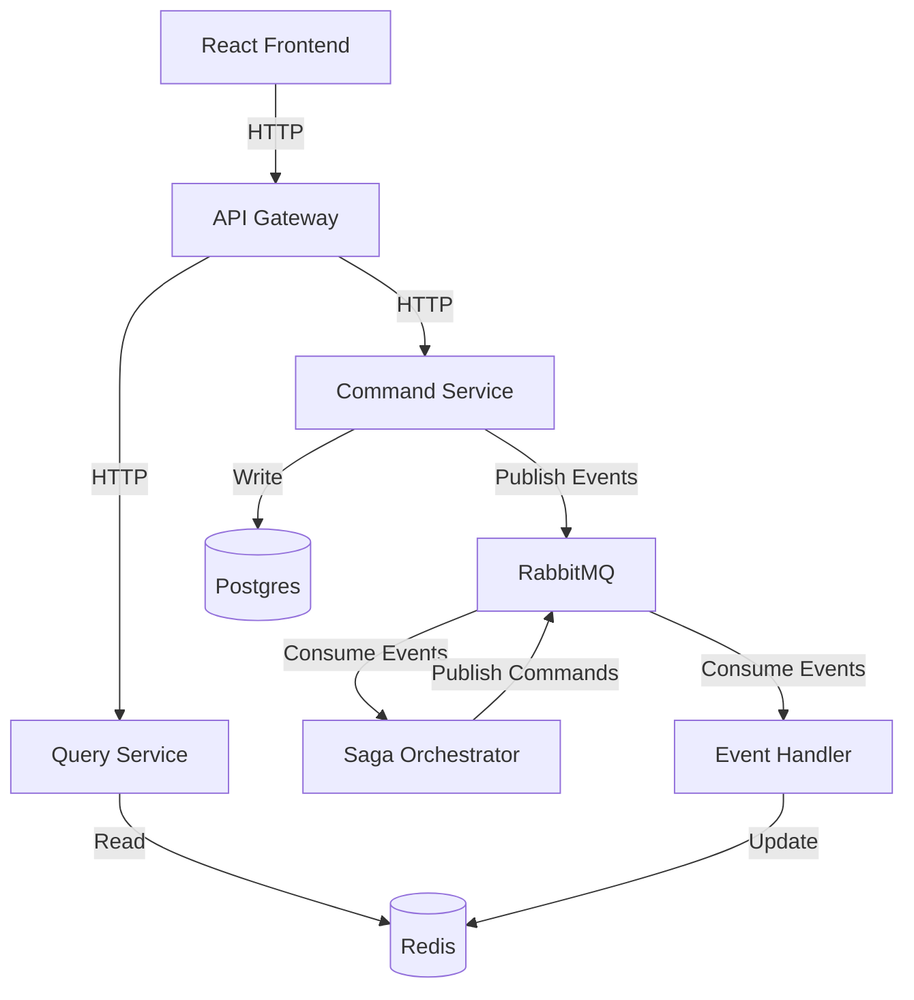
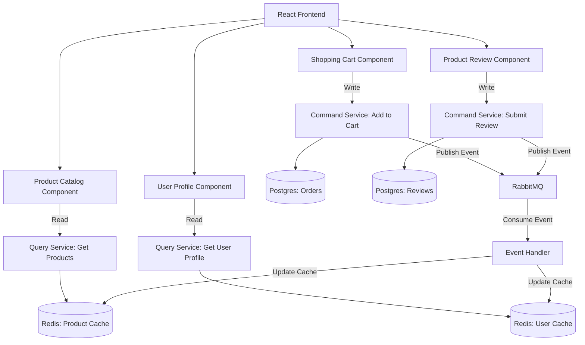

# microsvc-design
 Microservice Design Project

## Architecture Diagram

```mermaid
graph TD
    A[React Frontend] -->|HTTP| B[API Gateway]
    B -->|HTTP| C[Command Service]
    B -->|HTTP| D[Query Service]
    C -->|Publish Events| E[RabbitMQ]
    E -->|Consume Events| F[Saga Orchestrator]
    F -->|Publish Commands| E
    C -->|Write| G[(Postgres)]
    D -->|Read| H[(Redis)]
    I[Event Handler] -->|Update| H
    E -->|Consume Events| I
```

```mermaid
graph TD
    A[React Frontend] --> B[Product Catalog Component]
    A --> C[User Profile Component]
    A --> D[Shopping Cart Component]
    A --> E[Product Review Component]
    
    B -->|Read| F[Query Service: Get Products]
    C -->|Read| G[Query Service: Get User Profile]
    D -->|Write| H[Command Service: Add to Cart]
    E -->|Write| I[Command Service: Submit Review]
    
    F --> J[(Redis: Product Cache)]
    G --> K[(Redis: User Cache)]
    H --> L[(Postgres: Orders)]
    I --> M[(Postgres: Reviews)]
    
    H -->|Publish Event| N[RabbitMQ]
    I -->|Publish Event| N
    N -->|Consume Event| O[Event Handler]
    O -->|Update Cache| J
    O -->|Update Cache| K
```
