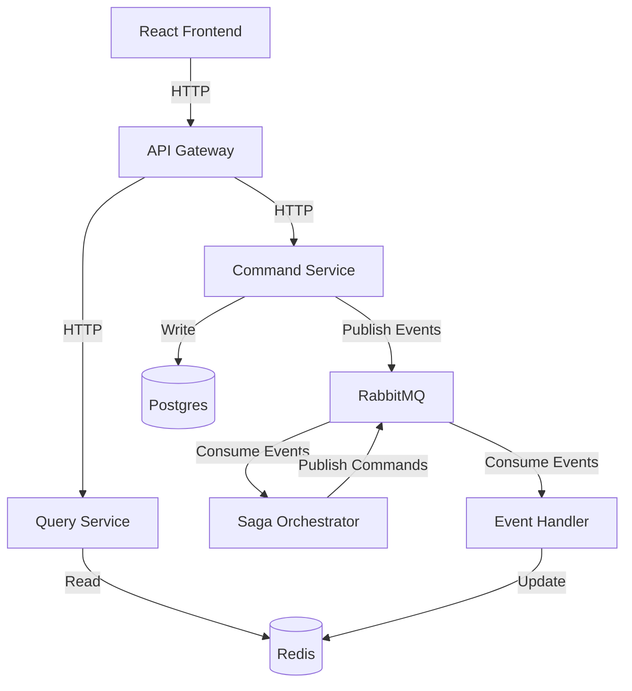

#  Microservice Design Project

# E-commerce Microservice Project Timeline

| Date Range | Phase | Tasks |
|------------|-------|-------|
| Jan 2024 - Mar 2024 | Backend Development | - Basic Structure - Database Setup - Caching & Message Queue - API Endpoints |
| Mar 2024 - May 2024 | Frontend Development | - Initial Setup - Frontend-Backend Integration - User Interface Development - State Management |
| May 2024 - Jul 2024 | Integration & Testing | - Authentication & Authorization - Error Handling & Validation - Testing |
| Jul 2024 - Nov 2024 | Optimization & Deployment | - Performance Optimization - Logging & Monitoring - Security Audit - Documentation - Deployment |

## Current Status (as of July 2024):
- API development is complete.
- Frontend development is in progress, with initial setup done and integration underway.
- Integration & Testing phase is beginning.
- Optimization & Deployment phase is upcoming.

## Next Steps:
1. Complete Frontend-Backend Integration
2. Finish User Interface Development
3. Implement Authentication & Authorization
4. Begin comprehensive testing

## Architecture Diagram

